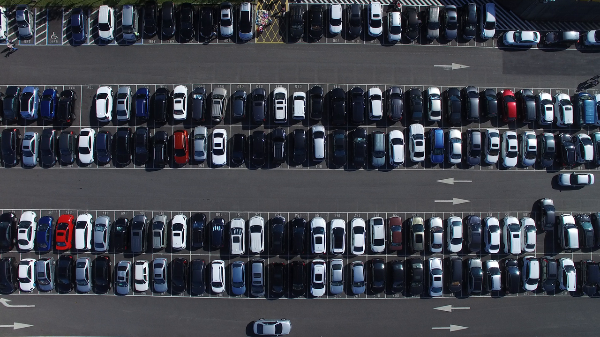
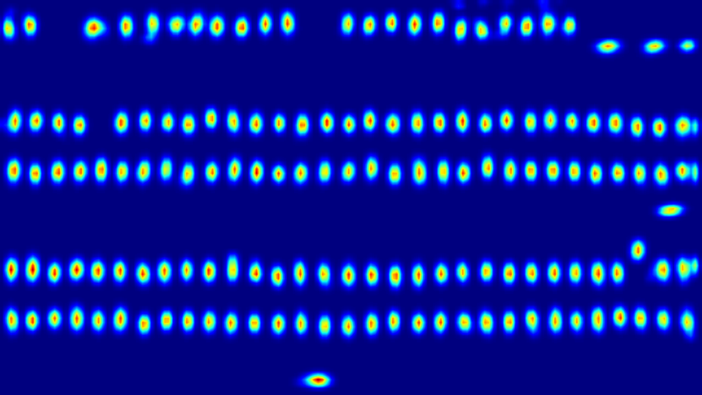
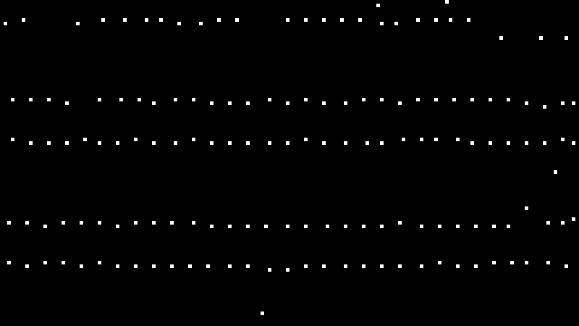
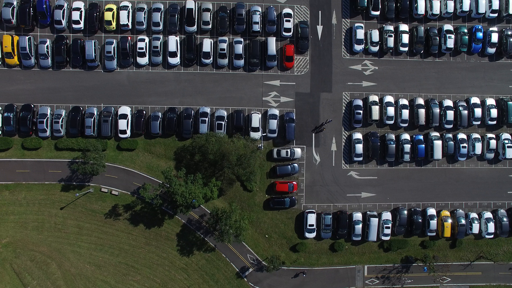
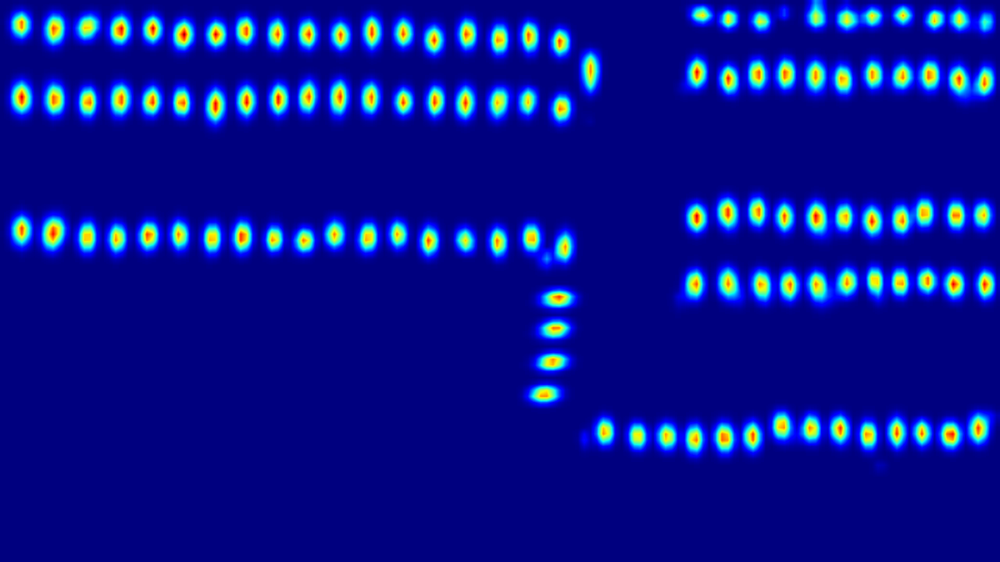
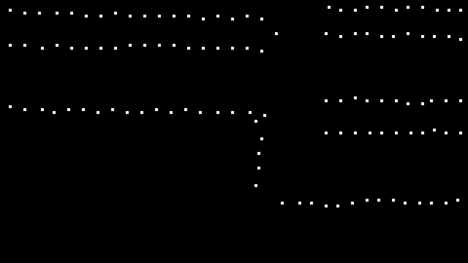

# Heatmap Learner Convolutional Neural Network for Object Counting and Localization
Member: <a href="https://github.com/ekilic/"> Ersin KILIÇ </a>  
Supervisor: <a href="https://avesis.erciyes.edu.tr/ozturks/"> Serkan ÖZTÜRK </a>  

<h2>Description</h2>

This project aims to implement a simple and effective single-shot detector model to count and locate the objects in aerial images. The code and data will be made available after peer review.

<h2>Results</h2>

Experiments on the two car datasets (<a href="https://lafi.github.io/LPN/">PUCPR+</a> and <a href="https://lafi.github.io/LPN/">CARPK</a>) show the state-of-the-art counting and localizing performance of the proposed method compared with existing methods.

<table>
<tbody>
<tr>
<td>&nbsp;CARPK Dataset</td>
<td>&nbsp;MAE</td>
<td>RMSE&nbsp;</td>
</tr>
<tr>
<td>Ours (VGG-16)&nbsp;</td>
<td>3.03&nbsp;</td>
<td>4.02</td>
</tr>
</tbody>
</table>

<table>
<tbody>
<tr>
<td>&nbsp;PUCPR+ Dataset</td>
<td>&nbsp;MAE</td>
<td>RMSE&nbsp;</td>
</tr>
<tr>
<td>Ours (VGG-16)&nbsp;</td>
<td>1.96&nbsp;</td>
<td>3.26</td>
</tr>
</tbody>
</table>

<h2>Sample Localization Results</h2>

<table>
<tbody>
<tr>
<td>Original</td>
<td>Heat map</td>
<td>Peak map</td>
</tr>
<tr>
<td></td>
<td></td>
<td></td>
</tr>
<tr>
<td></td>
<td></td>
<td></td>
</tr>
</tbody>
</table>
